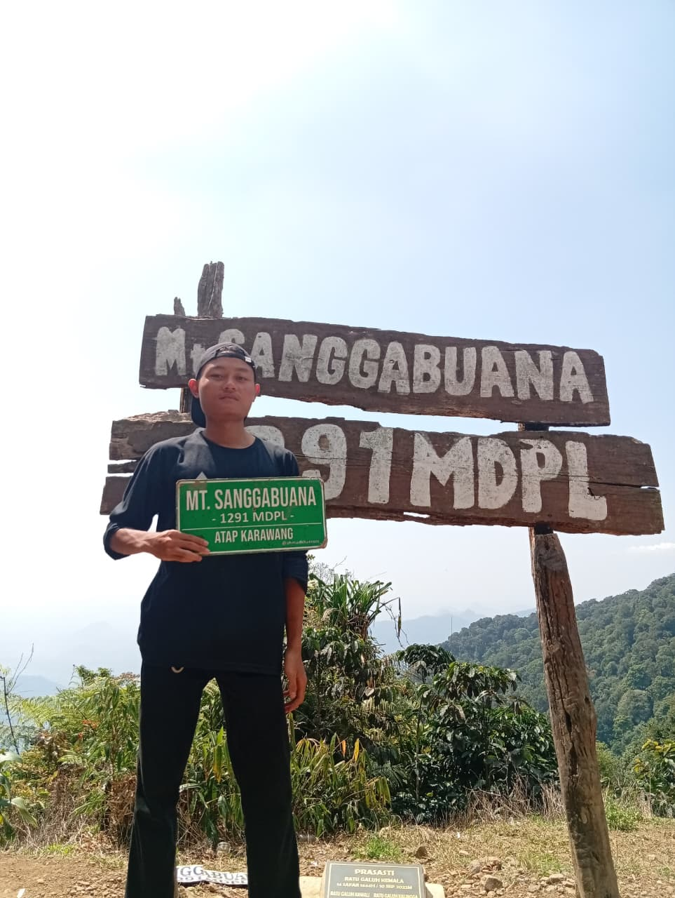

## Hi, I'm Farhan 👋

<!--
**farhanganteng260310/farhanganteng260310** is a ✨ _special_ ✨ repository because its `README.md` (this file) appears on your GitHub profile.

Here are some ideas to get you started:

- 🔭 I’m currently working on ...
- 🌱 I’m currently learning ...
- 👯 I’m looking to collaborate on ...
- 🤔 I’m looking for help with ...
- 💬 Ask me about ...
- 📫 How to reach me: ...
- 😄 Pronouns: ...
- ⚡ Fun fact: ...
-->

I'm a **Full-Stack & Mobile Developer Student** at SMK Sahabat Ilmu, passionate about building web applications and mobile apps while continuously improving my programming skills.

* 💻 **Web Development:** Laravel, PHP, JavaScript, React JS
* 📱 **Mobile Development:** Flutter & Dart
* 🗄️ **Database:** MySQL, SQLite
* 🎨 **Frontend:** Tailwind CSS, HTML, CSS
* 🛠️ **Tools:** Git & GitHub
* 🚀 **Currently Learning:** Mobile development with Flutter & Dart
* 🎯 **Goal:** Become a skilled Full-Stack & Mobile Developer
* ⚡ **Fun Fact:** I started with web development and now I'm exploring the world of mobile apps!

I enjoy learning new technologies, building projects, and turning ideas into real applications.
